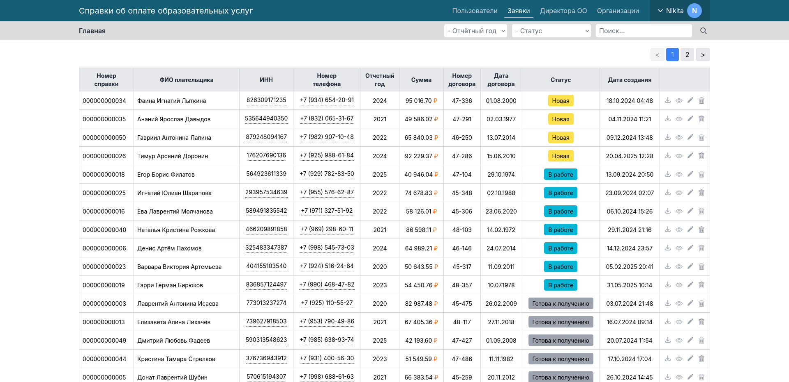

## Сервис для сбора и обработки Запросов справки об оплате образовательных услуг с сайта [ЛГТУ](https://stu.lipetsk.ru)

Приложение обеспечивает хранение и экспорт запросов плательщиков, а также отслеживание их версий,
оповещение плательщиков об изменениях; фильтр и поиск по запросам.  

Приложение поддерживает локальную аутентификацию пользователей и аутентификацию при помощи LDAP.
Подробнее в [документации](docs/CONFIG.md). 

## Требования к ПО
### Для локальной разработки / разворачивания через Docker
- [Docker](https://www.docker.com/get-started/) или [Docker Desktop](https://docs.docker.com/desktop/)

### На сервере
- Nginx / Apache
- [Composer](https://getcomposer.org/) 2.8.9
- [PHP](https://www.php.net/downloads.php) 8.2+
- [Node.js](https://nodejs.org/) 18.20 + NPM 10.8
- [PostgreSQL](https://www.postgresql.org/download/) 14 / [MySQL](https://dev.mysql.com/downloads/) 8 / MariaDB 10
- [Meilisearch](https://www.meilisearch.com/docs/learn/self_hosted/install_meilisearch_locally) 1.15
- Git (для обновления приложения, необязательно)

## Документация
1. [Установка](docs/INSTALL.md)
2. [Конфигурация](docs/CONFIG.md)
3. [База данных](docs/DATABASE.md)
4. [Интеграция (API)](docs/API.md)
